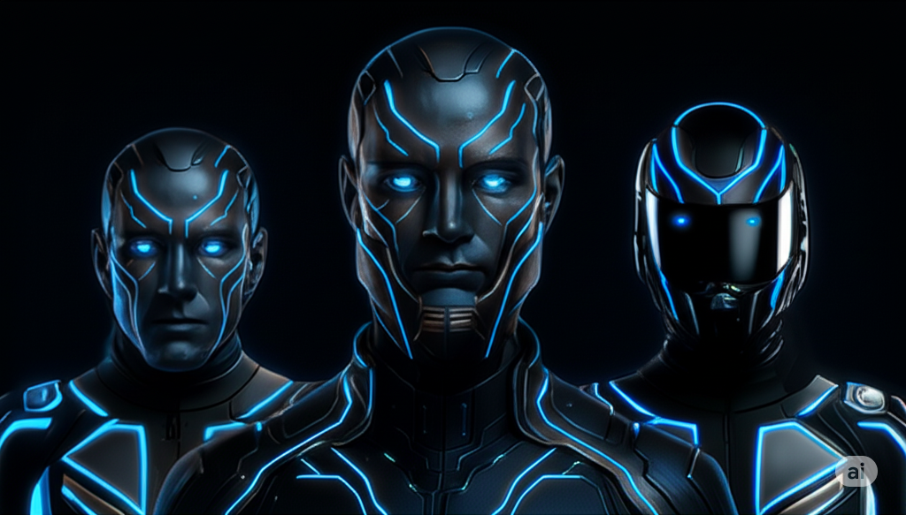

# LexOS Genesis - Neural Command Center

<div align="center">
  
  
  **Advanced AI Agent Orchestration Platform**
  
  [](LICENSE)
  [](https://nodejs.org)
  [](https://reactjs.org)
</div>

## 🧬 Overview

LexOS Genesis is a cutting-edge AI orchestration platform that provides enterprise-grade agent management, real-time system monitoring, and advanced AI infrastructure control. Built for high-performance computing environments with native H100 GPU support.

### 🚀 Key Features

- **Agent Orchestration**: Manage multiple AI agents with advanced task distribution
- **Real-time Monitoring**: Live system metrics for H100 GPU, CPU, memory, and storage
- **Security Hub**: Advanced authentication, access control, and security monitoring
- **Knowledge Graph**: 3D visualization of AI knowledge networks
- **Voice Integration**: Voice command interface with ElevenLabs integration
- **Task Pipeline**: Advanced workflow management and task execution
- **Analytics Dashboard**: Comprehensive system analytics and performance metrics

## 🏗️ Architecture

```
┌─────────────────┐    ┌─────────────────┐    ┌─────────────────┐
│   Frontend      │    │   Backend       │    │   AI Services   │
│   (React/TS)    │◄──►│   (Node.js)     │◄──►│   (Ollama)      │
│                 │    │                 │    │                 │
│ • Dashboard     │    │ • Agent Manager │    │ • LLM Models    │
│ • Monitoring    │    │ • Auth Service  │    │ • Embeddings    │
│ • Security      │    │ • WebSocket     │    │ • Voice AI      │
│ • Analytics     │    │ • Database      │    │ • GPU Compute   │
└─────────────────┘    └─────────────────┘    └─────────────────┘
```

## 🛠️ Installation

### Prerequisites

- Node.js 18+ 
- npm or yarn
- NVIDIA GPU (H100 recommended)
- Ollama (for AI models)

### Quick Start

```bash
# Clone the repository
git clone <repository-url>
cd lexos-genesis

# Install frontend dependencies
npm install

# Install backend dependencies
cd backend
npm install

# Set up environment variables
cp .env.example .env
# Edit .env with your configuration

# Initialize database
npm run init-db

# Start development servers
cd ..
npm run full:dev
```

### Production Deployment

```bash
# Build frontend
npm run build:prod

# Start backend in production mode
cd backend
npm run prod

# Start frontend server
npm start
```

## 🔧 Configuration

### Environment Variables

Key environment variables to configure:

```env
# Backend Configuration
NODE_ENV=production
PORT=3001
JWT_SECRET=your-secure-jwt-secret

# Default Credentials (CHANGE IN PRODUCTION!)
ADMIN_PASSWORD=your-secure-admin-password
OPERATOR_PASSWORD=your-secure-operator-password

# GPU Configuration
GPU_MONITORING_ENABLED=true
GPU_MEMORY_THRESHOLD=90
GPU_TEMP_THRESHOLD=85

# Ollama Configuration
OLLAMA_BASE_URL=http://localhost:11434
```

## 🔐 Security

### Default Credentials

**⚠️ CRITICAL: Change these immediately in production!**

- Admin: `admin` / `NEXUS_ADMIN_CHANGE_IMMEDIATELY`
- Operator: `operator` / `NEXUS_OPERATOR_CHANGE_IMMEDIATELY`

### Security Features

- JWT-based authentication
- Role-based access control (RBAC)
- Rate limiting
- Session management
- Security audit logging
- Content filtering

## 📊 System Requirements

### Minimum Requirements

- CPU: 8 cores
- RAM: 32GB
- Storage: 1TB SSD
- GPU: NVIDIA RTX 4090 or better

### Recommended (Production)

- CPU: 32+ cores
- RAM: 256GB
- Storage: 20TB NVMe SSD
- GPU: NVIDIA H100 80GB HBM3
- Network: 10Gbps

## 🎯 Usage

### Starting the System

1. **Backend**: Handles API requests, agent management, and system monitoring
2. **Frontend**: Web interface for system control and monitoring
3. **AI Services**: Ollama for LLM inference and AI processing

### Key Endpoints

- Dashboard: `/` - Main system overview
- Agents: `/agents` - Agent management
- Security: `/security` - Security hub
- Analytics: `/analytics` - System analytics
- Settings: `/settings` - Configuration

## 🔄 Development

### Project Structure

```
lexos-genesis/
├── src/                    # Frontend source
│   ├── components/         # React components
│   ├── pages/             # Page components
│   ├── services/          # API services
│   ├── hooks/             # Custom hooks
│   └── types/             # TypeScript types
├── backend/               # Backend source
│   ├── src/
│   │   ├── services/      # Business logic
│   │   ├── routes/        # API routes
│   │   └── utils/         # Utilities
│   └── package.json
├── public/                # Static assets
└── package.json
```

### Available Scripts

```bash
# Frontend
npm run dev              # Start development server
npm run build           # Build for production
npm run lint            # Run linter

# Backend
npm run backend:dev     # Start backend in dev mode
npm run backend:prod    # Start backend in production

# Full Stack
npm run full:dev        # Start both frontend and backend
```

## 🤝 Contributing

This is a proprietary system for the Sharma Legacy. Internal development only.

## 📄 License

PROPRIETARY - Sharma Legacy Systems

## 🆘 Support

For technical support, contact the Nexus development team.

---

**LexOS Genesis v2.0.0-nexus**  
*Sovereign AI Intelligence System*  
*Built for the Sharma Legacy*
